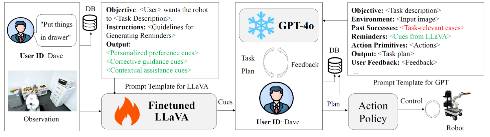
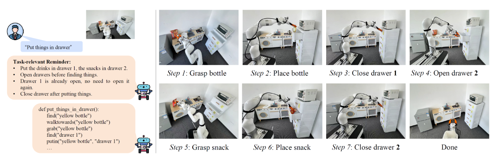

# AlignBot: Aligning VLM-powered Customized Task Planning with User Reminders Through Fine-Tuning for Household Robots

  

 : https://arxiv.org/pdf/2409.11905

 :https://yding25.com/AlignBot/

## AlignBot: Aligning VLM-powered Customized Task Planning with User Reminders Through Fine-Tuning for Household Robots

[Zhaxizhuoma](https://zxzm-zak.github.io/)1,†, [Pengan Chen](https://yding25.com/AlignBot/)1,2,†, [Ziniu Wu](https://ziniuw.com/)1,3,†, [Jiawei Sun](https://yding25.com/AlignBot/)1, [Dong Wang](https://yding25.com/AlignBot/)1, [Peng Zhou](https://yding25.com/AlignBot/)2, [Nieqing Cao](https://yding25.com/AlignBot/)4, [Yan Ding](https://yding25.com/)1,*, [Bin Zhao](https://yding25.com/AlignBot/)1,5, [Xuelong Li](https://yding25.com/AlignBot/)1,6

1Shanghai Artificial Intelligence Laboratory, 2The University of Hong Kong, 3University of Bristol, 4Xi’an Jiaotong-Liverpool University, 5Northwestern Polytechnical University, 6Institute of Artificial Intelligence, China Telecom Corp Ltd, †Equal contribution, *Corresponding author: Yan Ding [yding25 (at) binghamton.edu]

## Abstract

This paper presents AlignBot, a novel framework designed to optimize VLM-powered customized task planning for household robots by effectively aligning with user reminders. In domestic settings, aligning task planning with user reminders poses significant challenges due to the limited quantity, diversity, and multimodal nature of the reminder itself. To address these challenges, AlignBot employs a fine-tuned LLaVA-7B model, functioning as an adapter for GPT-4o. This adapter model internalizes diverse forms of user reminders—such as personalized preferences, corrective guidance, and contextual assistance—into structured that prompt GPT-4o in generating customized task plans. Additionally, AlignBot integrates a dynamic retrieval mechanism that selects relevant historical interactions as prompts for GPT-4o, further enhancing task planning accuracy. To validate the effectiveness of AlignBot, experiments are conducted in a real-world household environment. A multimodal dataset with 1,500 entries derived from volunteer reminder was used for training and evaluation. The results demonstrate that AlignBot significantly improves customized task planning, outperforming existing LLM- and VLM-powered planners by interpreting and aligning with user reminders, achieving 86.8% success rate compared to the vanilla GPT-4o baseline at 21.6%, reflecting 65% improvement and over four times greater effectiveness.

## Framework of AlignBot

The fine-tuned **LLaVA model** serves as an adapter for GPT-4o during inference, processing user id, task descriptions, and observations to produce cues that guide GPT-4o's task planning. These cues, combined with a dynamically retrieved **task-relevant cases** of past successes, are incorporated into the prompt, optimizing GPT-4o's generation of action plans. If the initial output does not meet user expectations, the system enables iterative dialogue, supporting multiple rounds of feedback and refinement until a satisfactory result is achieved.

For more details, please find more information in **Section A. Fine-Tuning LLaVA with User Reminders** and **Section B. Case-Based Learning for Enhanced GPT Prompting** of our paper.Illustration of the proposed framework (iHERO), which consists of the inter-robot and robot-operator communication protocol, the collaborative exploration strategy, and more importantly, the online adaptation module to operator requests.

## Experiments

We assess the performance of AlignBot from two key perspectives: the quality of task plans generated by GPT-4o and the quality of cues produced by the fine-tuned LLaVA. Baseline includes **Vanilla GPT-4o**, **GPT-4o + Raw Reminder**, **GPT-4o + LLaMA2-7b**.

We implement AlignBot on a real robotic system, comprising an AgileX-based mobile platform and a UFactory XArm robotic arm. The system employs the ACT algorithm alongside the AnyGrasp method for manipulation. In this setup, the robot is tasked with placing items from a countertop into a drawer, ensuring that the task plan generated is consistently aligned with user reminders.

## Results and Discussion

TABLE 1 shows the comparison result between AlignBot and the three baselines. AlignBot outperforms all baselines, demonstrating superior performance in aligning task planning with customized user reminders. Compared to Vanilla GPT-4o, AlignBot addresses significant limitations in semantic grounding, such as recognizing the object states (e.g., whether a drawer is open or closed). Vanilla GPT-4o tends to make random decisions in tasks due to missing user-specific information, while AlignBot, through its database of user reminders and fine-tuned cues, delivers much more accurate and effective task plans. When compared to GPT-4o + Raw Reminder, AlignBot again proves more effective, as GPT-4o + Raw Reminder often struggles to filter and apply the correct historical data for the current scenario, resulting in planning failures. The context-specific cues generated by AlignBot's adapter are essential for accurate task planning, particularly in complex environments. Finally, while GPT-4o + Fine-tuned LLaMA can remember user preferences and correct some common planning errors, its lack of multimodal capabilities limits its understanding of the scene and the arrangement of objects, leading to less reliable cues. AlignBot's ability to integrate multimodal inputs ensures better scene awareness and task alignment, demonstrating the necessity of multimodal adapters in improving task planning.

Our AlignBot demonstrates superior performance in cue generation compared to baselines. It receives high ratings from volunteers for its ability to combine task descriptions with image context, which allows it to deliver highly effective, scene-based cues. It also excels at remembering personalized user preferences, making its responses more accurate and tailored to individual needs, which significantly enhances its utility in real-world applications. When compared to Fine-tuned LLaMA, AlignBot's multimodal capabilities are a clear advantage. While Fine-tuned LLaMA can remember user preferences, its single-modal nature limits its effectiveness, especially in tasks requiring visual input. Without image guidance, Fine-tuned LLaMA randomly selects from past reminders and fails to provide accurate or context-specific cues, underscoring the importance of multimodal inputs in personalized tasks. In contrast, the LLaVA without Fine-tuning further highlights AlignBot's strengths, as it struggles with image-based reasoning often providing vague or generic descriptions of task-relevant items. LLaVA without Fine-tuning lacks the ability to interpret detailed visual information or infer operational errors, making it far less effective in guiding robots through real-world tasks. Additionally, without fine-tuning to incorporate user-specific data, its responses remain generic and less relevant, reinforcing the importance of AlignBot's tailored and fine-tuned approach to cue generation.

## Conclusion

To summarize, AlignBot demonstrates significant improvements in aligning robotic task planning with diverse, multimodal user reminders. By fine-tuning LLaVA-7B as an adapter for GPT-4o, the framework effectively handles the challenges posed by the nature of user reminders in household environments. The combination of instruction-formatted cues and case-based learning enables AlignBot to generate more accurate task plans. Empirical results show that AlignBot outperforms baselines.
