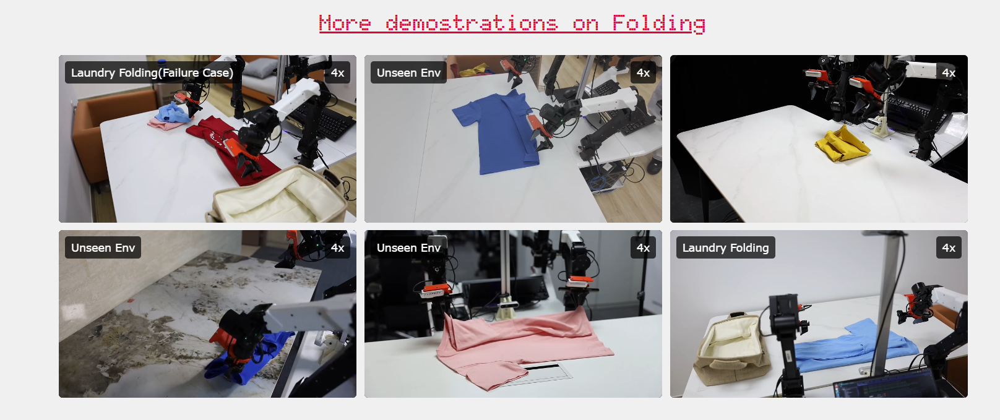
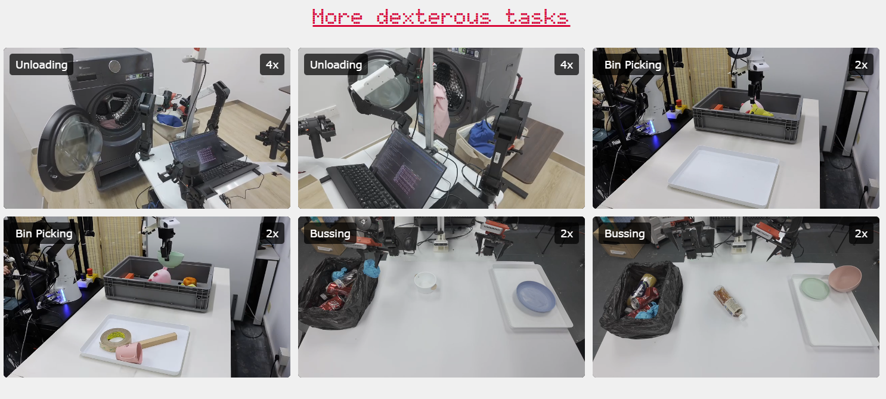
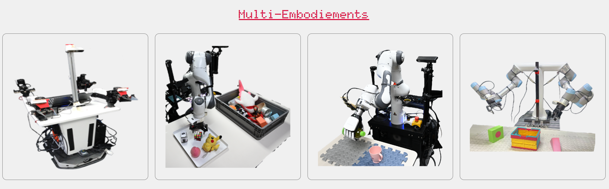
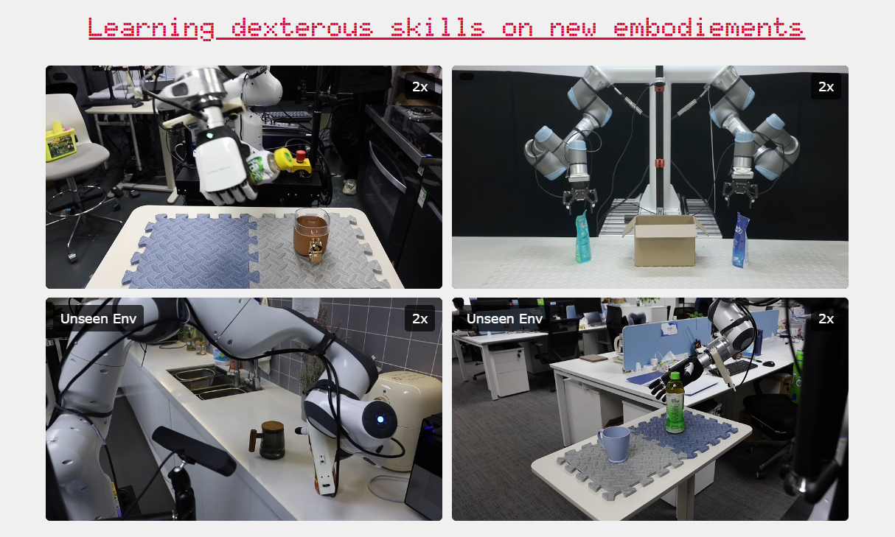
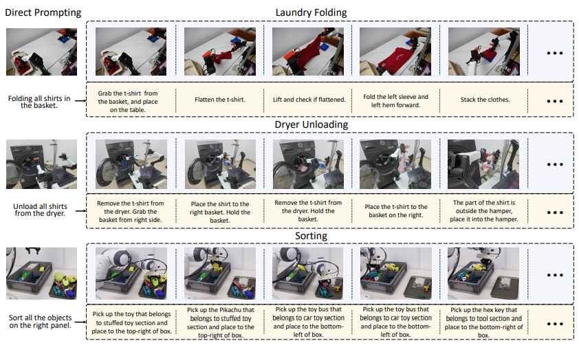

# DexVLA: Vision-Language Model with Plug-In Diffusion Expert for General Robot Control

  

 : https://arxiv.org/abs/2502.05855

 : https://dex-vla.github.io/

<h1 align="center">
	DexVLA: Vision-Language Model with Plug-In Diffusion Expert for General Robot Control 
</h1>
Junjie Wen*,1,2Yichen Zhu*,†,1Zhibin Tang1Jinming Li1,3Yaxin Peng3Chaomin Shen,†,2Xiaofeng Mou1Feifei Feng1
1. Midea Group2. East China Normal University3. Shanghai University

**Abstract:**

Enabling robots to perform diverse tasks across varied environments is a central challenge in robot learning. While vision-language-action (VLA) models have shown promise for generalizable robot skills, realizing their full potential requires addressing limitations in action representation and efficient training. Current VLA models often focus on scaling the vision-language model (VLM) component, while the action space representation remains a critical bottleneck. This paper introduces Dex-VLA, a novel framework designed to enhance the efficiency and generalization capabilities of VLAs for complex, long-horizon tasks across diverse robot embodiments. Dex-VLA features a novel diffusion-based action expert, scaled to one billion parameters, designed for cross-embodiment learning. A novel embodiment curriculum learning strategy facilitates efficient training: (1) pre-training the diffusion expert on cross-embodiment data, (2) aligning the VLA model to specific embodiments, and (3) post-training for rapid adaptation to new tasks. We conduct comprehensive experiments across multiple embodiments, including single-arm, bimanual, and dexterous hand, demonstrating Dex-VLA's adaptability to challenging tasks without task-specific adaptation, its ability to learn dexterous skills on novel embodiments with limited data, and its capacity to complete complex, long-horizon tasks using only direct language prompting, such as laundry folding. In all settings, our method demonstrates superior performance compared to state-of-the-art models like Octo, OpenVLA, and Diffusion Policy.

Model Framework and Embodied Curriculum Learning Strategy

DexVLA architecture and embodied curriculum learning. Our model employs a three-stage training process. Stage 1 (left) trains the Diffusion Expert independently, without the VLM. Stages 2 and 3 (middle) integrate the Diffusion Expert with a VLM, discarding the visual and language components within the expert. The Diffusion Expert (right) uses multiple heads for cross-embodiment learning.

