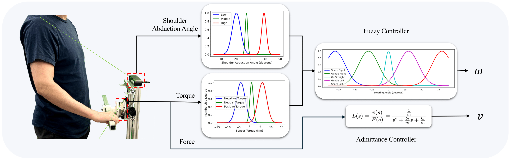
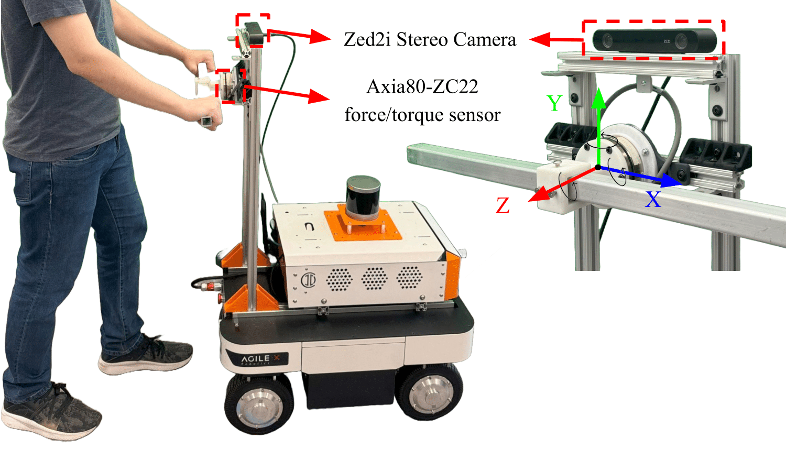
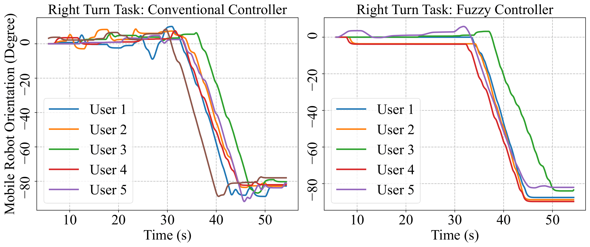

# Vision-Based Fuzzy Control System for Smart Walkers: Enhancing Usability for Stroke Survivors with Unilateral Upper Limb Impairments

|  

 : https://arxiv.org/abs/2502.00233

 : https://tbs-ualberta.github.io/fuzzy-sw/

<h1 align="center">
	Vision-Based Fuzzy Control System for Smart Walkers: Enhancing Usability for Stroke Survivors with Unilateral Upper Limb Impairments 
</h1>

Mahdi Chalaki, Amir Zakerimanesh, Abed Soleymani, Vivian Mushahwar, Mahdi Tavakoli

University of Alberta
ICRA 2025

*Block Diagram Illustrating Key Components of the Smart Walker Control Framework*

**Abstract:**

Mobility impairments, particularly those caused by stroke-induced hemiparesis, significantly impact independence and quality of life. Current smart walker controllers operate by using input forces from the user to control linear motion and input torques to dictate rotational movement; however, because they predominantly rely on user-applied torque exerted on the device handle as an indicator of user intent to turn, they fail to adequately accommodate users with unilateral upper limb impairments. This leads to increased physical strain and cognitive load. This paper introduces a novel smart walker equipped with a fuzzy control algorithm that leverages shoulder abduction angles to intuitively interpret user intentions using just one functional hand. By integrating a force sensor and stereo camera, the system enhances walker responsiveness and usability. Experimental evaluations with five participants showed that the fuzzy controller outperformed the traditional admittance controller, reducing wrist torque while using the right hand to operate the walker by 12.65\% for left turns, 80.36\% for straight paths, and 81.16\% for right turns. Additionally, average user comfort ratings on a Likert scale increased from 1 to 4. Results confirmed a strong correlation between shoulder abduction angles and directional intent, with users reporting decreased effort and enhanced ease of use. This study contributes to assistive robotics by providing an adaptable control mechanism for smart walkers, suggesting a pathway towards enhancing mobility and independence for individuals with mobility impairments.
Model Framework and Embodied Curriculum Learning Strategy

*Left: Illustration of mobility assistance with the Smart Walker* 

*Right: Coordinate reference frame on the force/torque sensor*

*Mobile robot orientation under conventional and proposed vision-based fuzzy controller, steering with one hand*

Video:
https://www.youtube.com/watch?v=VVpVfB4s7hE&t=3s