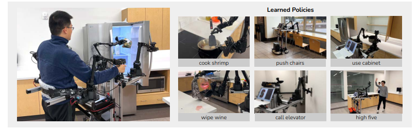
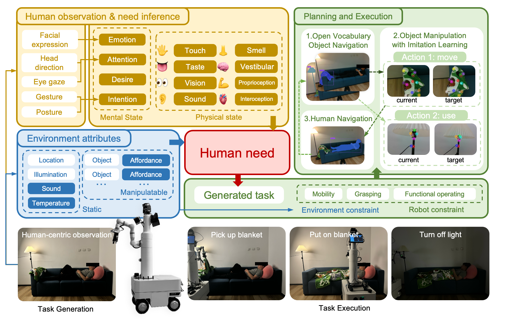
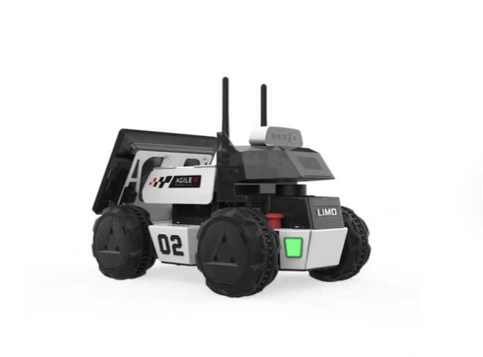
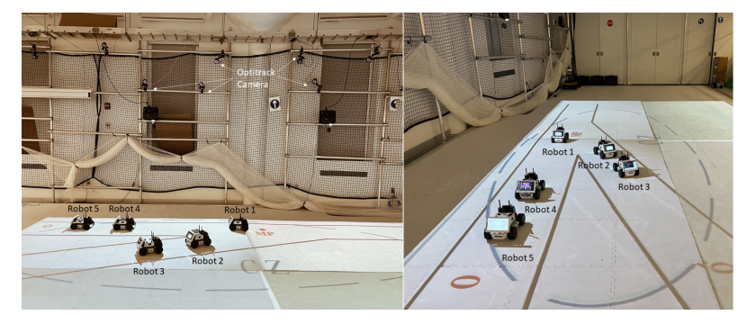
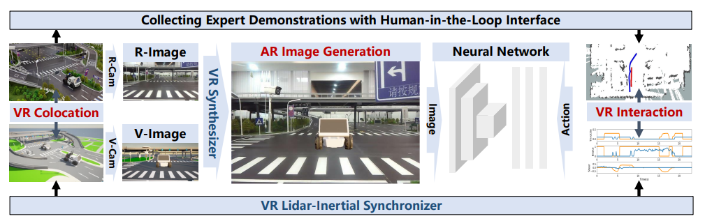

This repository collects the papers published based on AgileX devices, including paper links and project links.

## **RoboTwin: Dual-Arm Robot Benchmark with Generative Digital Twins**

  

**Hardware device: Cobot Magic**

**Abstract:**

Effective collaboration of dual-arm robots and their tool use capabilities are increasingly important areas in the advancement of robotics. These skills play a significant role in expanding robots' ability to operate in diverse real-world environments. However, progress is impeded by the scarcity of specialized training data. This paper introduces RoboTwin, a novel benchmark dataset combining real-world teleoperated data with synthetic data from digital twins, designed for dual-arm robotic scenarios. Using the COBOT Magic platform, we have collected diverse data on tool usage and human-robot interaction. We present a innovative approach to creating digital twins using AI-generated content, transforming 2D images into detailed 3D models. Furthermore, we utilize large language models to generate expert-level training data and task-specific pose sequences oriented toward functionality. Our key contributions are: 1) the RoboTwin benchmark dataset, 2) an efficient real-to-simulation pipeline, and 3) the use of language models for automatic expert-level data generation. These advancements are designed to address the shortage of robotic training data, potentially accelerating the development of more capable and versatile robotic systems for a wide range of real-world applications.

**[Details](RoboTwin.md)**

# RDT-1B: a Diffusion Foundation Model for Bimanual Manipulation

  

**Hardware device: Cobot Magic**

**Abstract:**

Bimanual manipulation is essential in robotics, yet developing foundation models is extremely challenging due to the inherent complexity of coordinating two robot arms (leading to multi-modal action distributions) and the scarcity of training data. In this paper, we present the Robotics Diffusion Transformer (RDT), a pioneering diffusion foundation model for bimanual manipulation. RDT builds on diffusion models to effectively represent multi-modality, with innovative designs of a scalable Transformer to deal with the heterogeneity of multi-modal inputs and to capture the nonlinearity and high frequency of robotic data. To address data scarcity, we further introduce a Physically Interpretable Unified Action Space, which can unify the action representations of various robots while preserving the physical meanings of original actions, facilitating learning transferrable physical knowledge. With these designs, we managed to pre-train RDT on the largest collection of multi-robot datasets to date and scaled it up to 1.2B parameters, which is the largest diffusion-based foundation model for robotic manipulation. We finally fine-tuned RDT on a self-created multi-task bimanual dataset with over 6K+ episodes to refine its manipulation capabilities. Experiments on real robots demonstrate that RDT significantly outperforms existing methods. It exhibits zero-shot generalization to unseen objects and scenes, understands and follows language instructions, learns new skills with just 1~5 demonstrations, and effectively handles complex, dexterous tasks. We refer to [this https URL](https://rdt-robotics.github.io/rdt-robotics/) for the code and videos.

**[Details](RDT.md)**

# Mobile ALOHA

## Learning Bimanual Mobile Manipulation with Low-Cost Whole-Body Teleoperation

  |  

**Hardware device: Cobot Magic**

**Abstract:**

Imitation learning from human demonstrations has shown impressive performance in robotics. However, most results focus on table-top manipulation, lacking the mobility and dexterity necessary for generally useful tasks. In this work, we develop a system for imitating mobile manipulation tasks that are bimanual and require whole-body control. We first present Mobile ALOHA, a low-cost and whole-body teleoperation system for data collection. It augments the ALOHA system with a mobile base, and a whole-body teleoperation interface. Using data collected with Mobile ALOHA, we then perform supervised behavior cloning and find that co-training with existing static ALOHA datasets boosts performance on mobile manipulation tasks. With 50 demonstrations for each task, co-training can increase success rates by up to 90%, allowing Mobile ALOHA to autonomously complete complex mobile manipulation tasks such as sauteing and serving a piece of shrimp, opening a two-door wall cabinet to store heavy cooking pots, calling and entering an elevator, and lightly rinsing a used pan using a kitchen faucet.

**[Details](MobileAloha.md)**

# AToM-Bot: Embodied Fulfillment of Unspoken Human Needs with Affective Theory of Mind

 |  

**Hardware device: Cobot S**

**Abstract:**

We propose **AToM-Bot**, a novel task generation and execution framework for proactive robot-human interaction, which leverages the human mental and physical state inference capabilities of the Vision Language Model (VLM) prompted by the Affective Theory of Mind (AToM). Without requiring explicit commands by humans, AToM-Bot proactively generates and follows feasible tasks to improve general human well-being. When around humans, AToM-Bot first detects current human needs based on inferred human states and observations of the surrounding environment. It then generates tasks to fulfill these needs, taking into account its embodied constraints. We designed 16 daily life scenarios spanning 4 common scenes and tasked the same visual stimulus to 59 human subjects and our robot. We used the similarity between human open-ended answers and robot output, and the human satisfaction scores to metric robot performance. AToM-Bot received high human evaluations in need detection (6.42/7, 91.7%), embodied solution (6.15/7, 87.8%) and task execution (6.17/7, 88.1%). We show that AToM-Bot excels in generating and executing feasible plans to fulfill unspoken human needs.

**[Details](AToM-Bot.md)**

# iHERO: Interactive Human-oriented Exploration and Supervision Under Scarce Communication

 

**Hardware device: LIMO**

**Abstract:**

Exploration of unknown scenes before human entry is essential for safety and efficiency in numerous scenarios, e.g., subterranean exploration, reconnaissance, search and rescue missions. Fleets of autonomous robots are particularly suitable for this task, via concurrent exploration, multi-sensory perception and autonomous navigation. Communication however among the robots can be severely restricted to only close-range exchange via ad-hoc networks. Although some recent works have addressed the problem of collaborative exploration under restricted communication, the crucial role of the human operator has been mostly neglected. Indeed, the operator may: (i) require timely update regarding the exploration progress and fleet status; (ii) prioritize certain regions; and (iii) dynamically move within the explored area; To facilitate these requests, this work proposes an interactive human-oriented online coordination framework for collaborative exploration and supervision under scarce communication (iHERO). The robots switch smoothly and optimally among fast exploration, intermittent exchange of map and sensory data, and return to the operator for status update. It is ensured that these requests are fulfilled online interactively with a pre-specified latency. Extensive large-scale human-in-the-loop simulations and hardware experiments are performed over numerous challenging scenes, which signify its performance such as explored area and efficiency, and validate its potential applicability to real-world scenarios.

**[Details](iHero.md)**

# Optimal Control of Connected Automated Vehicles with Event-Triggered Control Barrier Functions: a Test Bed for Safe Optimal Merging

  

-orange.svg) -orange.svg)

**Hardware device: LIMO**

**Abstract:**

Exploration of unknown scenes before human entry is essential for safety and efficiency in numerous scenarios, e.g., subterranean exploration, reconnaissance, search and rescue missions. Fleets of autonomous robots are particularly suitable for this task, via concurrent exploration, multi-sensory perception and autonomous navigation. Communication however among the robots can be severely restricted to only close-range exchange via ad-hoc networks. Although some recent works have addressed the problem of collaborative exploration under restricted communication, the crucial role of the human operator has been mostly neglected. Indeed, the operator may: (i) require timely update regarding the exploration progress and fleet status; (ii) prioritize certain regions; and (iii) dynamically move within the explored area; To facilitate these requests, this work proposes an interactive human-oriented online coordination framework for collaborative exploration and supervision under scarce communication (iHERO). The robots switch smoothly and optimally among fast exploration, intermittent exchange of map and sensory data, and return to the operator for status update. It is ensured that these requests are fulfilled online interactively with a pre-specified latency. Extensive large-scale human-in-the-loop simulations and hardware experiments are performed over numerous challenging scenes, which signify its performance such as explored area and efficiency, and validate its potential applicability to real-world scenarios.

Details： https://arxiv.org/abs/2306.01871

# Seamless Virtual Reality with Integrated Synchronizer and Synthesizer for Autonomous Driving

 | 

**Hardware device: LIMO**

**Abstract:**

Virtual reality (VR) is a promising data engine for autonomous driving (AD). However, data fidelity in this paradigm is often degraded by VR inconsistency, for which the existing VR approaches become ineffective, as they ignore the inter-dependency between low-level VR synchronizer designs (i.e., data collector) and high-level VR synthesizer designs (i.e., data processor). This paper presents a seamless virtual reality SVR platform for AD, which mitigates such inconsistency, enabling VR agents to interact with each other in a shared symbiotic world. The crux to SVR is an integrated synchronizer and synthesizer IS2 design, which consists of a drift-aware lidar-inertial synchronizer for VR colocation and a motion-aware deep visual synthesis network for augmented reality image generation. We implement SVR on car-like robots in two sandbox platforms, achieving a cm-level VR colocalization accuracy and 3.2% VR image deviation, thereby avoiding missed collisions or model clippings. Experiments show that the proposed SVR reduces the intervention times, missed turns, and failure rates compared to other benchmarks. The SVR-trained neural network can handle unseen situations in real-world environments, by leveraging its knowledge learnt from the VR space.

Details: https://arxiv.org/abs/2403.03541

# NeuPAN: Direct Point Robot Navigation with End-to-End Model-based Learning

 |  

**Hardware device: LIMO**

**Abstract:**

Navigating a nonholonomic robot in a cluttered environment requires extremely accurate perception and locomotion for collision avoidance. This paper presents NeuPAN: a real-time, highly-accurate, map-free, robot-agnostic, and environment-invariant robot navigation solution. Leveraging a tightly-coupled perception-locomotion framework, NeuPAN has two key innovations compared to existing approaches: 1) it directly maps raw points to a learned multi-frame distance space, avoiding error propagation from perception to control; 2) it is interpretable from an end-to-end model-based learning perspective, enabling provable convergence. The crux of NeuPAN is to solve a high-dimensional end-to-end mathematical model with various point-level constraints using the plug-and-play (PnP) proximal alternating-minimization network (PAN) with neurons in the loop. This allows NeuPAN to generate real-time, end-to-end, physically-interpretable motions directly from point clouds, which seamlessly integrates data- and knowledge-engines, where its network parameters are adjusted via back propagation. We evaluate NeuPAN on car-like robot, wheel-legged robot, and passenger autonomous vehicle, in both simulated and real-world environments. Experiments demonstrate that NeuPAN outperforms various benchmarks, in terms of accuracy, efficiency, robustness, and generalization capability across various environments, including the cluttered sandbox, office, corridor, and parking lot. We show that NeuPAN works well in unstructured environments with arbitrary-shape undetectable objects, making impassable ways passable.

**[Details](NeuPAN.md)**
