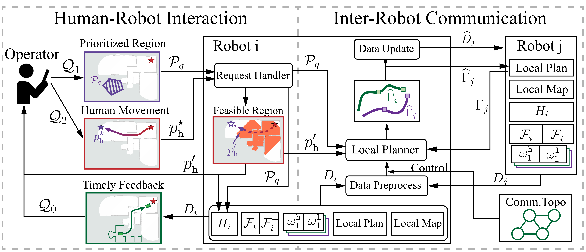
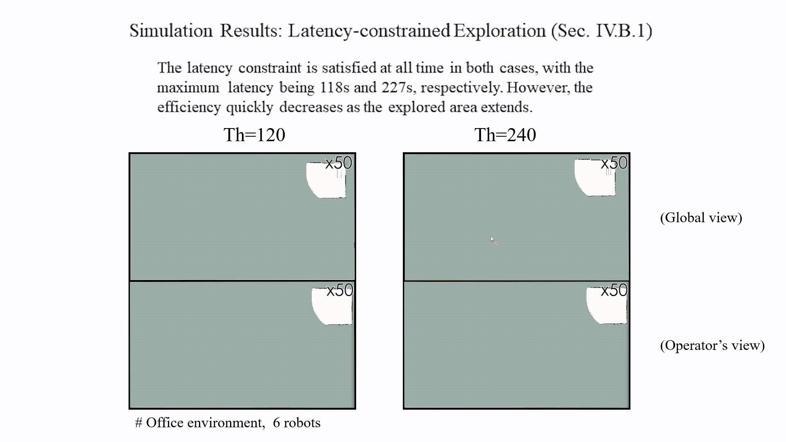
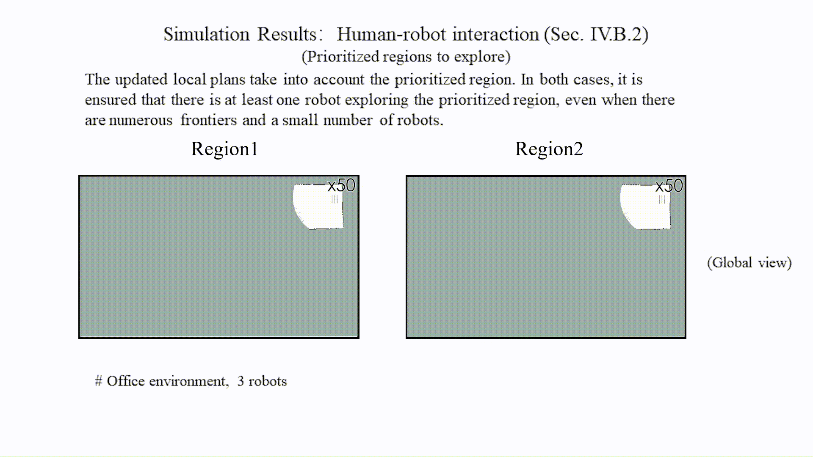
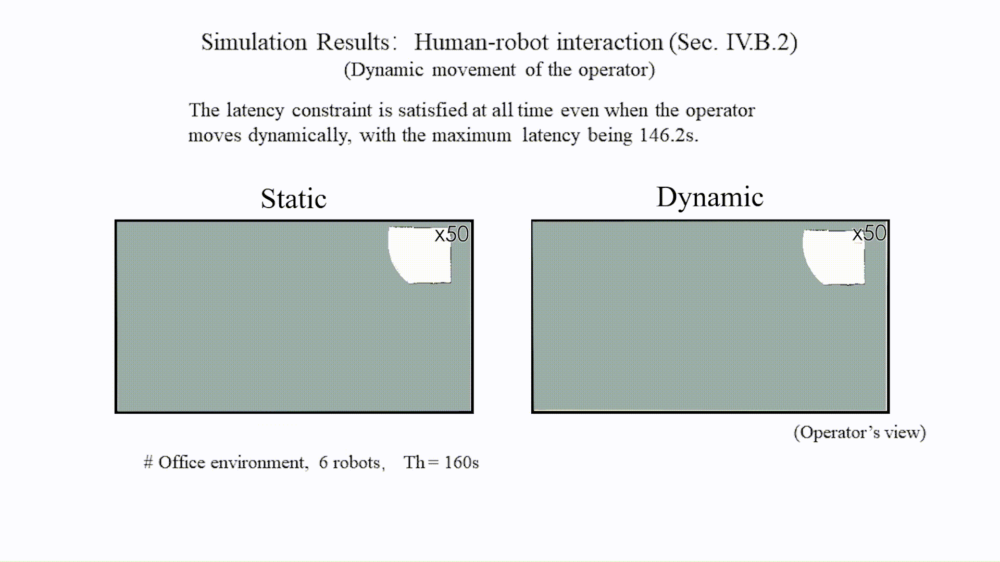
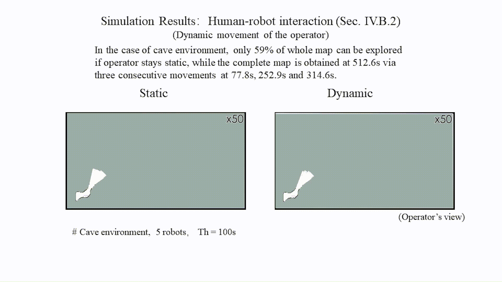
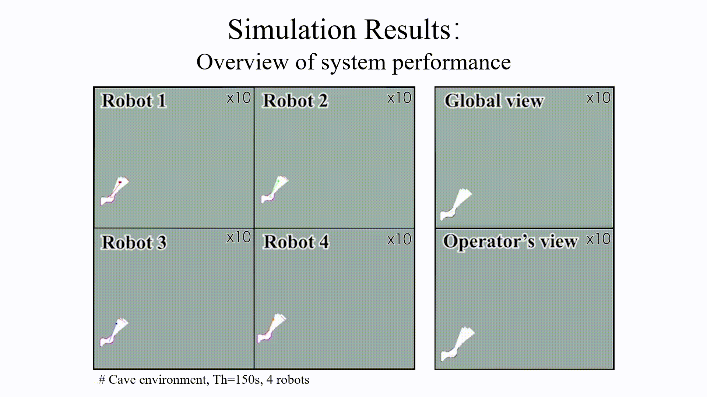
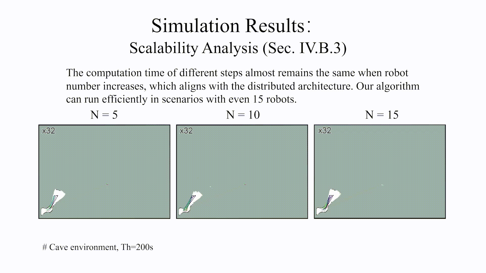
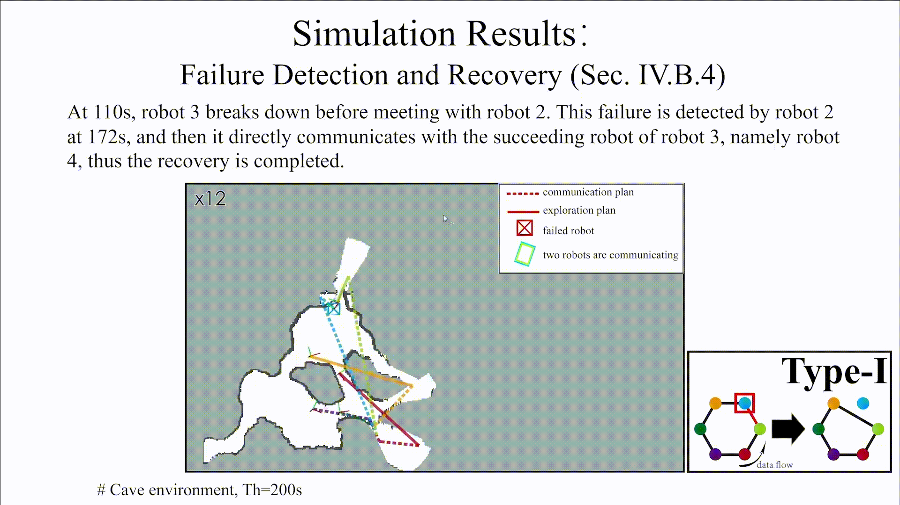
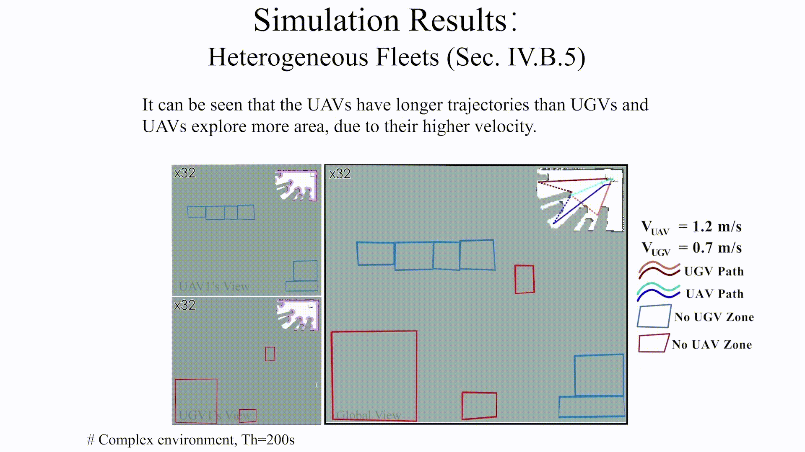

# iHERO: Interactive Human-oriented Exploration and Supervision Under Scarce Communication

  

 : https://arxiv.org/abs/2405.12571

 : https://zl-tian.github.io/iHERO/

## iHERO: Interactive Human-oriented Exploration and Supervision Under Scarce Communication

[Zhuoli Tian](https://zl-tian.github.io/iHERO/FIRST AUTHOR PERSONAL LINK), [Yuyang Zhang](https://zl-tian.github.io/iHERO/SECOND AUTHOR PERSONAL LINK), [Jinsheng Wei](https://zl-tian.github.io/iHERO/THIRD AUTHOR PERSONAL LINK), [Meng Guo](https://mengguo.github.io/personal_site/)

College of Engineering, Peking University
Robotics: Science and Systems (RSS) 2024

[Paper](https://arxiv.org/pdf/2405.12571) [arXiv](https://arxiv.org/abs/2405.12571)

Illustration of the considered scenario. Top-left: 4 UGVs switch among exploration, intermittent communication and return to the operator; Top-right: Different local maps at each robot, which are updated via pairwise communication; Bottom: three types of **human requests**: (i) **Prioritized regions** (in blue) to explore (Left); (ii) **Status update** with bounded latency via return events (Middle); (iii) **Dynamic movement** of the operator within the allowed region (in red) (Right).

## Abstract

Exploration of unknown scenes before human entry is essential for safety and efficiency in numerous scenarios, e.g., subterranean exploration, reconnaissance, search and rescue missions. Fleets of autonomous robots are particularly suitable for this task, via concurrent exploration, multi-sensory perception and autonomous navigation. Communication however among the robots can be severely restricted to only close-range exchange via ad-hoc networks. Although some recent works have addressed the problem of collaborative exploration under restricted communication, the crucial role of the human operator has been mostly neglected. Indeed, the operator may: (i) require timely update regarding the exploration progress and fleet status; (ii) prioritize certain regions; and (iii) dynamically move within the explored area; To facilitate these requests, this work proposes an interactive human-oriented online coordination framework for collaborative exploration and supervision under scarce communication (iHERO). The robots switch smoothly and optimally among fast exploration, intermittent exchange of map and sensory data, and return to the operator for status update. It is ensured that these requests are fulfilled online interactively with a pre-specified latency. Extensive large-scale human-in-the-loop simulations and hardware experiments are performed over numerous challenging scenes, which signify its performance such as explored area and efficiency, and validate its potential applicability to real-world scenarios.

## Overall Framework

Illustration of the proposed framework (iHERO), which consists of the inter-robot and robot-operator communication protocol, the collaborative exploration strategy, and more importantly, the online adaptation module to operator requests.

## Request Q-0: Bounded Latency

## Request Q-1: Prioritized Regions

## Request Q-2: Dynamic Movement of Operator

## Overview of System Performance

## Scalability Analysis

## Failure Detection & Recovery

## Heterogeneous Fleet

## Hardware Experiments

